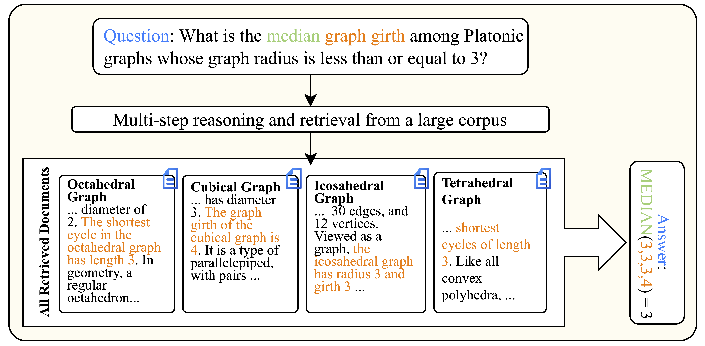

# Total Recall QA: A Verifiable Evaluation Suite for Deep Research Agents

<!-- [Paper](LINK_TO_ARXIV) |  -->
<!-- [Hugging Face Dataset](https://huggingface.co/datasets/mahtaa/trqa) |  -->
<!-- [Evaluation](https://github.com/mahta-r/total-recall-qa/tree/main/c5_task_evaluation) -->

Total Recall QA (TRQA) is a benchmark designed to evaluate deep research systems on **total-recall queries**  - question answering tasks where accurate generation of the answer requires retrieving **all relevant documents** from a large corpus, as well as **reasoning and synthesizing** information across all relevant documents. Unlike traditional QA benchmarks that reward partial retrieval, TRQA evaluates systems in settings where complete recall is necessary for correct reasoning.

<p align="center">
  
</p>

Empirical results demonstrate that TRQA is challenging in both retrieval and reasoning for deep research agents. Single retrieval rounds even with deep rank lists often yield poor recall, and the multi-round retrieval of DRAs still results in poor performance. Closed-book LLMs (notably GPT-5.2) dominate on real-world subsets of TRQA; but LLM-only performance drops sharply on TRQA's synthtic subset, exposing the impact of data contamination and cross-domain generalizability in evaluating DRAs. Experiments show agents issue roughly the same number of sub-queries regardless of the number of relevant entities, and additional sub-queries retrieve mostly irrelevant rather than new gold entities. Even under Oracle retrieval, state-of-the-art LLMs still struggle on the majority of queries, with 90% reasoning failure despite access to complete evidence.

TRQA is built using an entity-centric data generation framework over a paired structured knowledge base and aligned text corpus. An entity set from the knowledge base yields a structured question and a single numerical verifiable answer by applying structured constraints and aggregation operators over a target attribute. An LLM then converts this structured specification into a natural-language query.

<p align="center">
  
</p>


We apply this framework to three sources, yielding three complementary subsets of TRQA:
- **Wiki1**: Questions about encycolpedic knowledge from wikipedia, aggregating information over a complete set of entities (e.g all U.S. states)
- **Wiki2**: Questions built on top of [QALD-10](https://github.com/KGQA/QALD-10) and [QUEST](https://github.com/google-research/language/tree/master/language/quest) queries, aggregating information from the target entity sets of these queries.
- **Ecommerce**: Queries about a synthetically-generated E-commerce domain, asking about product specifiations/statistics in the dataset.

<!-- Each subset provides:
- validation queries
- validation qrels
- test queries
- test qrels
- corpus -->

<!-- --- -->

## Links
- [Paper](https://arxiv.org/abs/2603.18516)
- [Hugging Face](https://huggingface.co/datasets/mahtaa/trqa)
- [Getting Started](#getting-started)
- [Dataset Overview](#dataset-overview)
- [Evaluation](#evaluation)
- [Citation](#citation)

<!-- --- -->


## Getting Started

### Installation

To load the dataset:

```bash
pip install datasets
```

<!-- --- -->

### Loading the Dataset

```python
from datasets import load_dataset

# Load test queries from wiki1
queries = load_dataset("mahtaa/trqa", "queries", split="wiki1_test")

# Load qrels
qrels = load_dataset("mahtaa/trqa", "qrels", split="wiki1_test")

# Load corpus (wiki1 and wiki2 share the same Wikipedia corpus)
corpus = load_dataset("mahtaa/trqa", "corpus", split="wiki")

# Load ecommerce data
ecom_queries = load_dataset("mahtaa/trqa", "queries", split="ecommerce_test")
ecom_corpus = load_dataset("mahtaa/trqa", "corpus", split="ecommerce")
```

You can also download the query jsonl and trec qrel files directly [here](https://github.com/mahta-r/total-recall-qa/tree/main/dataset/TRQA).

<!-- --- -->

## Dataset Overview

The dataset contains three subsets:

| Subset     | Domain        | #Queries (Validation) | #Queries (Test) | Corpus Size  |
|------------|--------------|-----------------------|-----------------|--------------|
| wiki1      | Wikipedia     | 91                    | 169             | 57,745,780 (shared) |
| wiki2      | Wikipedia     | 1,083                 | 1,258           | 57,745,780 (shared) |
| ecommerce  | E-commerce    | 321                   | 900             | 3,282,927    |

The dataset on [Hugging Face](https://huggingface.co/datasets/mahtaa/trqa/) is organized into three configs, each with multiple splits:

| Config | Splits | Description |
|--------|--------|-------------|
| `queries` (default) | `wiki1_test`, `wiki1_validation`, `wiki2_test`, `wiki2_validation`, `ecommerce_test`, `ecommerce_validation` | Questions with single-response numerical answers |
| `qrels` | `wiki1_test`, `wiki1_validation`, `wiki2_test`, `wiki2_validation`, `ecommerce_test`, `ecommerce_validation` | Relevance judgments for passages |
| `corpus` | `wiki`, `ecommerce` | Passage collections |

Note: wiki1 and wiki2 share the same Wikipedia corpus (`wiki` split).

<!-- --- -->

### Data Format

#### Queries

Each line is a JSON object:

```json
{
  "id": "31_Q19598654_P8986-P7391",
  "question": "What is the median graph girth among Platonic graphs whose graph radius is less than or equal to 3?",
  "answer": 3.0
}
```

Fields:

- `id` — Query ID
- `question` — Total-recall query
- `answer` — Ground-truth numerical final answer 

---

#### Qrels 

Each line is a JSON object:

```json
{
  "query_id": "31_Q19598654_P8986-P7391",
  "iteration": "0",
  "doc_id": "30606-0001",
  "relevance": 1
}
```

Fields:

- `query_id` — Query ID
- `iteration` — Typically 0
- `doc_id` — Passage ID
- `relevance` — Relevance label (1 = relevant)

The qrels are converted from TREC format - each line in the TREC qrels is converted to a json line.

---

#### Corpus

Each line is a JSON object representing a passage:

```json
{
  "id": "30606-0001",
  "title": "Tetrahedron",
  "contents": "In the case of a tetrahedron, the base is a triangle (any of the four faces can be considered the base), so a tetrahedron is also known as a \"triangular pyramid\". The graph of a tetrahedron has shortest cycles of length 3.0..."
}
```

Fields:

- `id` — Passage ID. The format is `<document_id>-<chunk_id>`, where the number after the last dash is the chunk index within the original document (e.g., `30606-0001` is chunk `0001` of document `30606`).
- `title` — Passage title
- `contents` — Passage text

---

## Evaluation

All our experiment outputs, run files and indices for corpora are available on [Hugging Face](https://huggingface.co/datasets/mahtaa/synthetic_ecommerce_indices/tree/main).


### Installation

Install evaluation dependencies:

```bash
pip install -r evaluation_requirements.txt
```

**Note:** [Pyserini](https://github.com/castorini/pyserini) requires Java 11+. Make sure Java is installed and `JAVA_HOME` is set before installing.

For GPU-accelerated FAISS (used with the `--faiss_gpu` flag), replace `faiss-cpu` with `faiss-gpu`:

```bash
pip install faiss-gpu
```

### Running Experiments

Evaluation scripts for running specific experiments are available in the `c5_task_evaluation/` directory of this repository.

Please refer to the [evaluation README](https://github.com/mahta-r/total-recall-qa/tree/main/c5_task_evaluation).

---

## Citation

If you use TRQA in your research, please cite:

```bibtex
@misc{rafiee2026totalrecallqaverifiable,
      title={Total Recall QA: A Verifiable Evaluation Suite for Deep Research Agents}, 
      author={Mahta Rafiee and Heydar Soudani and Zahra Abbasiantaeb and Mohammad Aliannejadi and Faegheh Hasibi and Hamed Zamani},
      year={2026},
      eprint={2603.18516},
      archivePrefix={arXiv},
      primaryClass={cs.IR},
      url={https://arxiv.org/abs/2603.18516}, 
}
```

## Acknowledgments
We thank the organizers of SWIRL 2025 who provided a collabora- tive environment for the authors of this work to brainstorm and lay the ground work for this project. We also thank Bhaskar Mitra for participation in the initial discussions of this project.
This work was supported in part by the Center for Intelligent Information Retrieval, in part by NSF grant #2402873, in part by the Office of Naval Research contract #N000142412612, in part by the Informatics Institute (IvI) of the University of Amsterdam, and in part by the project LESSEN with project number NWA.1389.20.183 of the research program NWA ORC 2020/21 which is (partly) financed by the Dutch Research Council (NWO). Any opinions, findings, and conclusions or recommendations expressed in this material are those of the authors and do not necessarily reflect those of the sponsors.